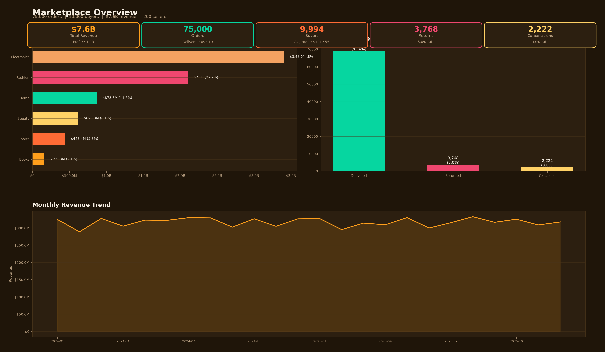
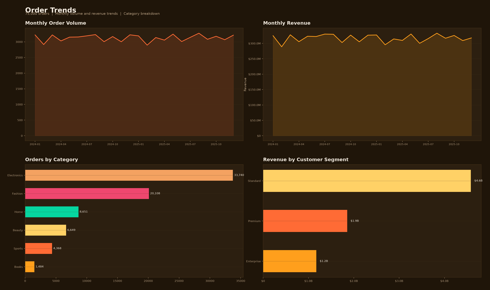
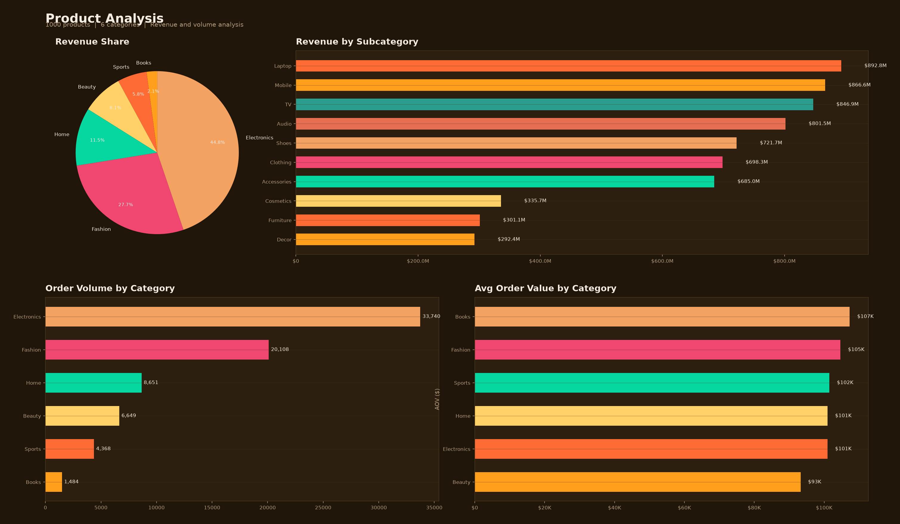
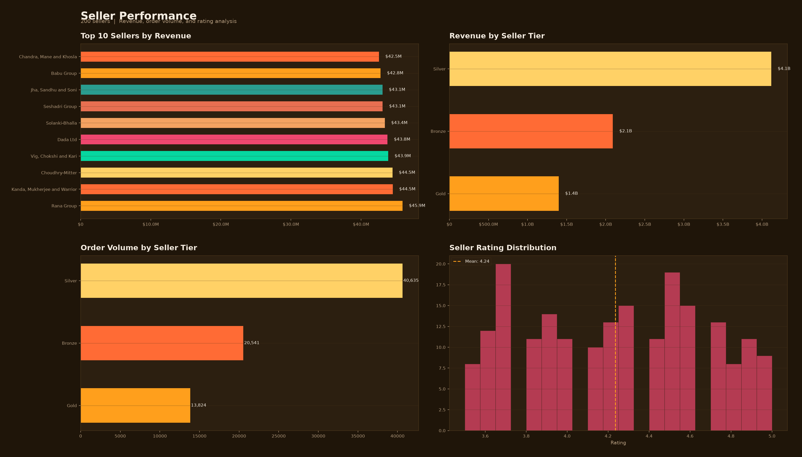
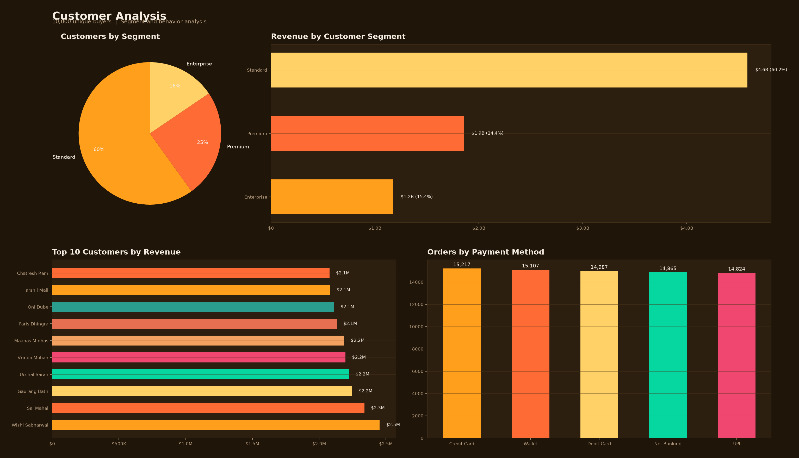

# Marketplace Revenue Analytics

[](https://github.com/kavyanjali-karan/marketplace-growth-performance-review/actions/workflows/ci.yml) [](tests/) [](LICENSE)

Analyzed 75,000 **simulated** orders across 10,000 buyers to find that Electronics drove 44.8% of income while returns and cancellations totaled 8.0% of orders. Built Power BI reports with DAX measures to track earnings, buyer, and seller metrics across 7 performance areas.

**Live dashboard:** [interactive dashboard](https://kavyanjali-karan.github.io/Marketplace-Growth-Performance-Review/dashboard.html) — regenerated by CI on every push.

## The reporting problem

The marketplace had grown to 75,000 orders but reporting was fragmented across spreadsheets. Category-level profitability was unclear — the team knew Electronics was "big" but didn't know it was 44.8% of revenue. Return and cancellation rates were tracked per-order but never aggregated to surface the 8% loss rate. Seller performance and buyer segmentation existed in separate systems with no unified view.

## What this repo does

1. **Star-Schema Dimensional Model** — Customer, product, seller, and date dimensions feeding a central `fact_orders` table with 75,000 transaction records
2. **7 Power BI Dashboards** — Marketplace overview, revenue trends, order analysis, seller performance, product analysis, customer segmentation, and category deep-dives
3. **DAX Measure Library** — Reusable measures for revenue, order counts, average order value, seller ratings, and customer lifetime metrics
4. **Metric Governance** — Standardized indicator definitions to align calculations across all 7 reporting areas

## Key Numbers

| Metric | Value |
|--------|-------|
| Total Orders | 75,000 |
| Unique Buyers | 10,000 |
| Total Revenue | $7.6B |
| Electronics Revenue Share | 44.8% ($3.4B) |
| Returns | 3,768 (5.0%) |
| Cancellations | 2,222 (3.0%) |
| Returns + Cancellations | 5,990 (8.0%) |
| Reporting Areas | 7 |

## Data

Simulated marketplace platform (similar to Olist/Brazilian e-commerce):

| Dataset | Records | Description |
|---------|---------|-------------|
| `orders.csv` | 75,000 | Orders with customer, seller, product, status, dates, amounts |
| `customers.csv` | 10,000 | Buyer profiles with segment, location, signup date |
| `products.csv` | Product catalog | Category, subcategory, brand, pricing |
| `sellers.csv` | Seller profiles | Tier, region, rating, join date |
| `payments.csv` | Payment records | Method, installments, status |

### Revenue by Category

| Category | Revenue | Share | Orders |
|----------|---------|-------|--------|
| Electronics | $3.4B | 44.8% | 33,739 |
| Fashion | $2.1B | 27.7% | 20,110 |
| Home | $873.4M | 11.5% | 8,648 |
| Beauty | $620.1M | 8.1% | 6,650 |
| Sports | $443.4M | 5.8% | 4,368 |
| Books | $159.4M | 2.1% | 1,485 |

### Order Status Breakdown

| Status | Count | Share |
|--------|-------|-------|
| Delivered | 69,010 | 92.0% |
| Returned | 3,768 | 5.0% |
| Cancelled | 2,222 | 3.0% |

### Payment Methods

| Method | Orders | Share |
|--------|--------|-------|
| Credit Card | 15,218 | 20.3% |
| Wallet | 15,106 | 20.1% |
| Debit Card | 14,988 | 20.0% |
| Net Banking | 14,863 | 19.8% |
| UPI | 14,825 | 19.8% |

Regenerate with:
```bash
pip install pandas numpy
python data/generate_data.py
```

## Dashboards

Rendered from this repository's own curated data — nothing is hand-drawn. The stills below are produced by
[`python/generate_dashboard_pngs.py`](python/generate_dashboard_pngs.py) and the interactive page by
[`python/generate_dashboards.py`](python/generate_dashboards.py), using the same Power BI design system:
marketplace overview, order trends, product analysis, seller performance, and customer segmentation.

### Market Overview


### Order Trends


### Product Analysis


### Seller Performance


### Customer Analysis


### Regenerating the dashboards

```bash
python data/generate_data.py              # datasets (seeded, reproducible)
python python/generate_dashboard_pngs.py  # renders assets/*.png
python python/generate_dashboards.py      # builds assets/dashboard.html (Chart.js inlined, no CDN)
```

GitHub Actions rebuilds both dashboards from the committed data before publishing to Pages, so the
live dashboard always matches the images in this README.

## Project Structure

```
├── data/
│   ├── raw/              # orders, customers, products, sellers, payments
│   ├── curated/          # Dimension tables, fact_orders
│   └── warehouse/        # Targets and calendars
├── sql/
│   ├── ddl/              # Table definitions
│   ├── staging/          # Staging views
│   ├── marts/            # Business marts
│   ├── metrics/          # Metric calculations
│   ├── monitoring/       # Data quality checks
│   └── reporting/        # Dashboard queries
├── python/
│   ├── extraction/       # Data loading
│   ├── transformation/   # Cleaning and enrichment
│   ├── validation/       # Quality checks
│   ├── monitoring/       # Pipeline health
│   ├── reporting/        # Business report scripts
│   ├── generate_dashboard_pngs.py   # Renders the dashboard PNGs in assets/
│   └── generate_dashboards.py       # Builds the interactive assets/dashboard.html
├── powerbi/
│   ├── dax/              # DAX measure library
│   └── model/            # Semantic model docs
├── outputs/              # Generated reports
├── docs/                 # Architecture, glossary, metric dictionary, scorecards
├── tests/                # Data quality tests (pytest)
└── assets/               # Dashboard screenshots
```

## Running Tests

```bash
pip install pytest pandas numpy
pytest
```

20 tests covering data quality, dimensional-model integrity, and the headline numbers above. Datasets are generated on first run, so the suite passes on a fresh clone.

## Tech Stack

SQL, Python (pandas, numpy), Power BI, DAX, Power Query, pytest, GitHub Actions, Git
